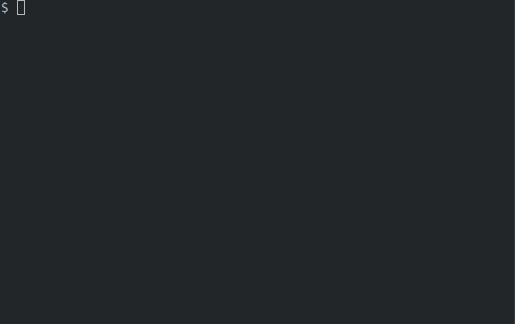

# tere - a faster alternative to cd + ls


`tere` is a terminal file explorer. It is a faster alternative to using `cd`
and `ls` to browse folders in your terminal. It only really does one thing: it
allows you to navigate to a folder efficiently using a TUI, and then prints the
path to that folder when you exit.



Note that `tere` is not a file _manager_, it
can only be used to browse folders, not to create, rename or delete them.

`tere` aims to be minimal and simple. It should be obvious how to use it.
Navigating the file system should be efficient and require as few keystrokes as
possible. A great source of inspiration for `tere` is the "type-ahead search"
functionality found in many GUI file managers.

"Tere" means "hello" in Estonian. It also feels nice to type.

## Setup

To start using `tere`, follow these steps:

1. Obtain a copy of `tere`. This can be done in various ways:

   - Download the [latest release](https://github.com/mgunyho/tere-rs/releases).
   - Install `tere` with [Homebrew](https://brew.sh) by running `brew install tere`.
   - Install `tere` with [Nix](https://nixos.org/) by running `nix-env -i tere`.
   - Install `tere` with [Cargo](https://www.rust-lang.org/tools/install) by running `cargo install tere`.
   - Build from source, see [below](#hacking).

1. Configure your shell to `cd` to the folder which `tere` prints when it exits. It has to be usually done using a function or alias, since a subprocess cannot change the working directory of the parent.

    For bash/zsh, put this in your `.bashrc` or `.zshrc`:

    ```sh
    tere() {
        local result=$(command tere "$@")
        [ -n "$result" ] && cd -- "$result"
    }
    ```

    For fish, put this in your `config.fish`:
    ```sh
    function tere
        set --local result (command tere $argv)
        [ -n "$result" ] && cd -- "$result"
    end
    ```

    For xonsh v0.10 or newer, put this in your `.xonshrc`:

    ```py
    def _tere(args):
        result = $(tere @(args)).strip()
        if result:
            cd @(result)

    aliases["tere"] = _tere
    ```

    For powershell core, put this in your `$PROFILE`:
    ```sh
    function Invoke-Tere() {
        $result = . C:\path\to\tere $args
        if ($result) {
            Set-Location $result
        }
    }
    Set-Alias tere Invoke-Tere
    ``` 

    For Windows Command Prompt, put this in a batch script file called `tere.bat` in a folder included in your `PATH` environment variable such as `C:\Windows`:
    ```batch
    @echo off

    rem set the location/path of the tere executable here...
    SET TereEXE=C:\path\to\tere.exe

    FOR /F "tokens=*" %%a in ('%TereEXE% %*') do SET OUTPUT=%%a
    IF [%OUTPUT%] == [] goto :EOF
    cd %OUTPUT%
    ``` 

    If `tere` is not in your `PATH`, use an absolute path to the tere binary in your shell config file. For example, for bash/zsh, you would need to replace `local result=$(command tere "$@")` with `local result=$(/path/to/tere "$@")`.

    If instructions for your shell are missing, feel free to send a pull request that includes them!

1. That's it. The next time you open a new shell, the command `tere` should work (you can also of course call the shell function/alias whatever you like). The above shell configuration also acts as a config file for `tere`, just add the options you want (see `tere --help`).

### Supported platforms

Currently, `tere` is tested on and built for Ubuntu. On Mac, it should be enough to compile the program yourself and the above bash/zsh shell configuration should work out of the box. Windows should also in principle work (the TUI is rendered using a cross-platform library), you just has to figure out the correct shell configuration. Pull requests welcome!

### Hacking

To compile `tere` from source, follow the standard procedure:

1. [Install the Rust toolchain](https://www.rust-lang.org/tools/install)
1. `git clone git@github.com:mgunyho/tere.git`
1. `cd tere`
1. Run `cargo build` (`--release` for the release version)

This will place the `tere` binary in the folder `target/debug`, or `target/release` if you used `--release`.

New features should go on the `develop` branch before they are released.

## User guide

You can navigate folders in `tere` by using the arrow keys and by typing to search. Basic navigation works by moving the cursor up or down, and pressing <kbd>Enter</kbd> or the right arrow <kbd>→</kbd> to enter the highlighted folder. You can move to the parent folder by pressing <kbd>Enter</kbd> on the parent folder item `..`, or with the left arrow <kbd>←</kbd>. Below is a full list of keyboard shortcuts.

### Keyboard shortcuts

`tere` has the following keyboard shortcuts:

| Action | Shortcut(s) |
|:---:|:---:|
|Move cursor up  | <kbd>↑</kbd> or <kbd>Alt</kbd>+<kbd>k</kbd> |
|Move cursor down| <kbd>↓</kbd> or <kbd>Alt</kbd>+<kbd>j</kbd> |
|Enter directory | <kbd>Enter</kbd> or <kbd>→</kbd> or <kbd>Alt</kbd>+<kbd>↓</kbd> or <kbd>Alt</kbd>+<kbd>l</kbd> or if not searching, <kbd>Space</kbd> |
|Go to parent directory| <kbd>←</kbd> or <kbd>Alt</kbd>+<kbd>↑</kbd> or <kbd>Alt</kbd>+<kbd>h</kbd> or if not searching, <kbd>Backspace</kbd> or <kbd>-</kbd> |
|Exit `tere`| <kbd>Esc</kbd> or <kbd>Alt</kbd>+<kbd>q</kbd> |
|Exit `tere` without changing directory| <kbd>Ctrl</kbd>+<kbd>c</kbd> |
|Go to home directory| <kbd>~</kbd> or <kbd>Ctrl</kbd>+<kbd>Home</kbd> or <kbd>Ctrl</kbd>+<kbd>Alt</kbd>+<kbd>h</kbd>|
|Go to root directory| <kbd>/</kbd> or <kbd>Alt</kbd>+<kbd>r</kbd>|
|Refresh current directory| <kbd>Ctrl</kbd>+<kbd>r</kbd>|
|Move cursor up   by one screen| <kbd>Page Up</kbd>   or <kbd>Ctrl</kbd>+<kbd>u</kbd> or <kbd>Alt</kbd>+<kbd>u</kbd> |
|Move cursor down by one screen| <kbd>Page Down</kbd> or <kbd>Ctrl</kbd>+<kbd>d</kbd> or <kbd>Alt</kbd>+<kbd>d</kbd> |
|Move cursor to the top   | <kbd>Home</kbd> or <kbd>Alt</kbd>+<kbd>g</kbd> |
|Move cursor to the bottom| <kbd>End</kbd>  or <kbd>Alt</kbd>+<kbd>Shift</kbd>+<kbd>g</kbd> |
|Change case sensitivity mode| <kbd>Alt</kbd>+<kbd>c</kbd> |
|Change gap search mode| <kbd>Ctrl</kbd>+<kbd>f</kbd> |
|Show help screen| <kbd>?</kbd> |

Some of the shortcuts starting with <kbd>Alt</kbd> should be familiar to Vim users.

### Searching

To search for an item in the current folder, just type some letters. `tere` will incrementally highlight all folders and files that match the search query.

While searching, moving the cursor up or down jumps between only the items that match the search. The search query, as well as the number of matching items is shown at the bottom of the screen.

If only one folder matches your current search, `tere` will highlight it, and change the working directory to that folder. This way you can navigate folders very quickly.

To stop searching, press <kbd>Esc</kbd> or erase all search characters by pressing <kbd>Backspace</kbd>.

By default, the searching uses "smart case", meaning that if the query contains only lowercase letters, case is ignored, but if there are uppercase letters, the search is case sensitive. This can be changed with the `--ignore-case` and `--case-sensitive` options, or with the keyboard shortcut <kbd>Alt</kbd>+<kbd>c</kbd> while `tere` is running.

In addition, in the default search mode, "gap search" is enabled. This means that the search query matches any folder or file name that contains the searched characters, even if there are other characters between them. For example, searching for `dt` would match both `DeskTop` and `DocumenTs`. This behavior can be changed with the `--gap-search-anywhere` and `--no-gap-search` options, or with the keyboard shortcut <kbd>Ctrl</kbd>+<kbd>f</kbd> while `tere` is running. See the output of the `--help` option for further details.

### Mouse navigation

Although `tere` is mainly keyboard-focused, it is also possible to navigate using the mouse. To maximize compatibility, mouse support is off by default, and has to be enabled with the option `--mouse=on`. With the mouse enabled, you can change to a folder by clicking on it, and move to the parent folder by right-clicking.

### CLI options

You can adjust the behavior of `tere` by passing the following CLI options to it:

- `--help` or `-h`: Print a short help and all CLI options. Note that the output goes to stderr, to not interfere with `cd` ing in the shell functions defined during the setup.
- `--version` or `-V`: Print the version of `tere`. This also goes to stderr.
- `--filter-search` or `-f` / `--no-filter-search` or `-F`: If `--filter-search` is set, show only items that match the current search query in the listing. Otherwise all items are shown in the listing while searching (this is the default behavior).
- `--folders-only` or `-d` / `--no-folders-only` or `-D`: With `--folders-only`, don't show files but only folders (and symlinks pointing to folders) in the listing.
- `--smart-case` or `-S` / `--ignore-case` or `-i` / `--case-sensitive` or `-s`: Set the case sensitivity mode. The default mode is smart case, which is case insensitive if the query contains only lowercase letters and case sensitive otherwise.
- `--gap-search` or `-g` / `--gap-search-anywhere` or `-G` / `--no-gap-search` or `-n`: Configure whether to allow matches with gaps in them (see above).
- `--autocd-timeout` - If the current search matches only one folder, automatically change to that folder after this many milliseconds. Can also be set to `off`, which disables this behaviour.
- `--history-file`: To make browsing more convenient, `tere` saves a history of folders you have visited to this file in JSON format. It should be an absolute path. Defaults to `$CACHE_DIR/tere/history.json`, where `$CACHE_DIR` is `$XDG_CACHE_HOME` or `~/.cache`. Set to the empty string `''` to disable saving the history. Note that the history reveals parts of your folder structure if it can be read by someone else.
- `--mouse=on` or `--mouse=off`: Enable or disable navigating with the mouse. If enabled, you can left-click to enter folders and right-click to go to the parent folder. Off by default.

Some options have two or more versions that override each other (for example `--folders-only` and `--no-folders-only`). For such options, whichever is passed last wins. This way, you can have one option as the default in your shell's `rc` file, but you can sometimes manually override that option when running `tere`.

## Similar projects

The idea of `tere` is by no means unique. There are actually quite a few CLI
applications that attempt to make folder navigation faster. Below is a
non-exhaustive list of such programs. The purpose of this section is to justify
the existence of `tere` by showing how it is different from all these
applications in subtle but important ways.

If there is a program that should be mentioned here, feel free to open an issue
or pull request about it!

### Terminal file browsers

These programs are designed for basically the same task as `tere`: navigate to a
folder in the terminal and then `cd` to it.

- [Broot](https://dystroy.org/broot/) - Broot is more focused on browsing large directories, and has a more complex UI than `tere`.
- [xplr](https://github.com/sayanarijit/xplr) - Lots of features, fully customizable. Not entirely focused on navigation, has file management features. Navigation by searching requires jumping between typing and pressing arrow keys.
- [deer](https://github.com/Vifon/deer) - zsh only, searching requires extra keystrokes.
- [cdir](https://github.com/EskelinenAntti/cdir) - Basically exactly the same idea as `tere`, but in written in Python. Doesn't have Vim-like keyboard navigation, and it's not a standalone binary.
- [llama](https://github.com/antonmedv/llama) - Very similar to `tere`, written in Go.
- [sdn](https://git.janouch.name/p/sdn) - Also very similar to `tere`, even in terms of the UI as well. Type-ahead search mode is not the default, searching requires a couple of extra keystrokes.

### Fuzzy matching and history-based navigation

These programs have a very similar goal as `tere`, to speed up filesystem
navigation. However, these kinds of programs are not well suited for
exploration, as they require that you visit a folder before you can jump to it.
They also differ from `tere` in philosophy; `tere` aims to be deterministic,
while the results of a fuzzy match or "frecency"-based query vary depending on
your previous queries.

- [z](https://github.com/rupa/z)
- [autojump](https://github.com/wting/autojump)
- [zoxide](https://github.com/ajeetdsouza/zoxide)
- [fasd](https://github.com/clvv/fasd)
- [jump](https://github.com/gsamokovarov/jump)
- [bashmarks](https://github.com/huyng/bashmarks)
- [goto](https://github.com/ankitvad/goto)
- [fzf](https://github.com/junegunn/fzf)
- [skim](https://github.com/lotabout/skim)

### Terminal file managers

There are quite a few terminal file managers, and they can often be used in the
same way as `tere`, for example using the `--choosedir` option of ranger.
However, they have a huge number of other features compared to `tere`, which
usually leads to a more complex UI and a higher learning curve. File managers are
also not entirely focused on navigation, and therefore often require extra
keystrokes to search and navigate folders. File management is not in the scope of
`tere`, so these programs are not directly comparable to it.

- [ranger](https://ranger.github.io/)
- [nnn](https://github.com/jarun/nnn)
- [Midnight Commander](https://midnight-commander.org/)
- [vifm](https://vifm.info/)
- [clifm](https://github.com/leo-arch/clifm) (C)
- [clifm](https://github.com/pasqu4le/clifm) (Haskell)
- [lf](https://github.com/gokcehan/lf)
- [fff](https://github.com/dylanaraps/fff)
- [joshuto](https://github.com/kamiyaa/joshuto)
- [hunter](https://github.com/rabite0/hunter)

### Other similar programs

- [noice](https://git.2f30.org/noice/file/README.html) - Very similar to `tere`, but there is no option to print the current directory on exit. Filtering/searching directory contents requires two extra keystrokes.
- [twilight commander](https://github.com/golmman/twilight-commander) - Main goal seems to be a folder tree browser embedded in other apps. No search. No option to go above the initial working directory.


## License

Copyright 2022 András Márton Gunyhó. Licensed under the EUPL, see the `LICENSE` file.
